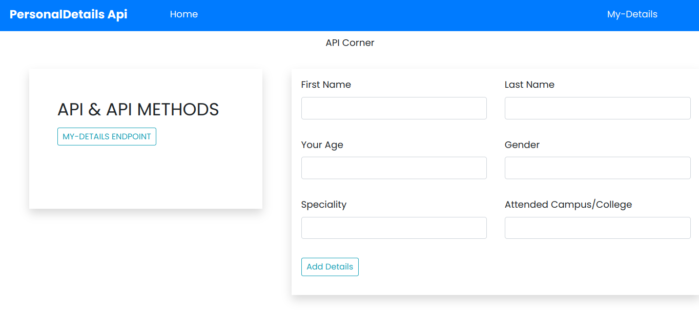

## REST API
Its a simple web django application that allows user to enter personal details through a form and acess those details from database using Api.

### Author
Nazarena Wambura.</br>
[Github Account](https://github.com/nazarena254)


### Homepage


### Setup/Installation Requirements
1. Create a folder and cd to it.
2. Clone the repository below with the command `git clone <https option url> .`  <br>
3. Install dependencies in the requirements.txt file `pip install -r requirements.txt` .  

## Database
1. Set up Database(postgresql),and put your username and password in the code
2. Make migrations `python3 manage.py makemigrations`
3. Migrate `python3 manage.py migrate` 
       
### Running the Application
1. Run main aplication locally on http://127.0.0.1:8000/ local host<br>    
   * python3.9 manage.py runserver<br>

# RESTful API Notes
## RESTful API
An API is a convenient way to provide users access to data from our application

### django-rest-framework
We use the **django-rest-framework** to enable us to build a restful api.<br/> 
We will begin by creating a very basic structure that can handle GET requests then move on to adding authentication and handling POST request.
To install `pip install djangorestframework`

project/settings.py
```bash
INSTALLED_APPS = [
.......
    'rest_framework',
]
```
### Serializers
A serializer is a component that will convert Django models to JSON objects and vice-versa.
news/serializer.py
```bash
from rest_framework import serializers
from .models import MoringaMerch

class MerchSerializer(serializers.ModelSerializer):
    class Meta:
        model = MoringaMerch
        fields = ('name', 'description', 'price')   OR fields =' __all__'
```
* Then create urls for api in project/urls.py
* We configure our API to also allow us to add data to our database in views.py

### POST request
To retrieve data from our database we want to configure our API to also allow us to add data to our database

## Authentication
To allow the Admin to add new Items/data.
project/settings.py
```bash
INSTALLED_APPS = [
    'rest_framework.authtoken'
]
.....
REST_FRAMEWORK = {
    'DEFAULT_AUTHENTICATION_CLASSES': (
        'rest_framework.authentication.TokenAuthentication',
    )
}
```
* Remember to do migrations
* Add authentication app url in the urlpatterns
project/urls.py
```bash
from rest_framework.authtoken.views import obtain_auth_token
.......
urlpatterns = [
.......
    path('api-token-auth/', obtain_auth_token)
]
```

* We create a new POST request and pass in the username and password in our app
app/permissions.py
```bash 
from rest_framework.permissions import SAFE_METHODS, BasePermission

class IsAdminOrReadOnly(BasePermission):
    def has_permission(self, request, view):
        if request.method in SAFE_METHODS:
            return True
        else:
            return request.user.is_staff
```

* We then add the permissions to the API view class.
news/views.py
```bash
from .permissions import IsAdminOrReadOnly
 ........
class MerchList(APIView):
 .........
    permission_classes = (IsAdminOrReadOnly,)
```    